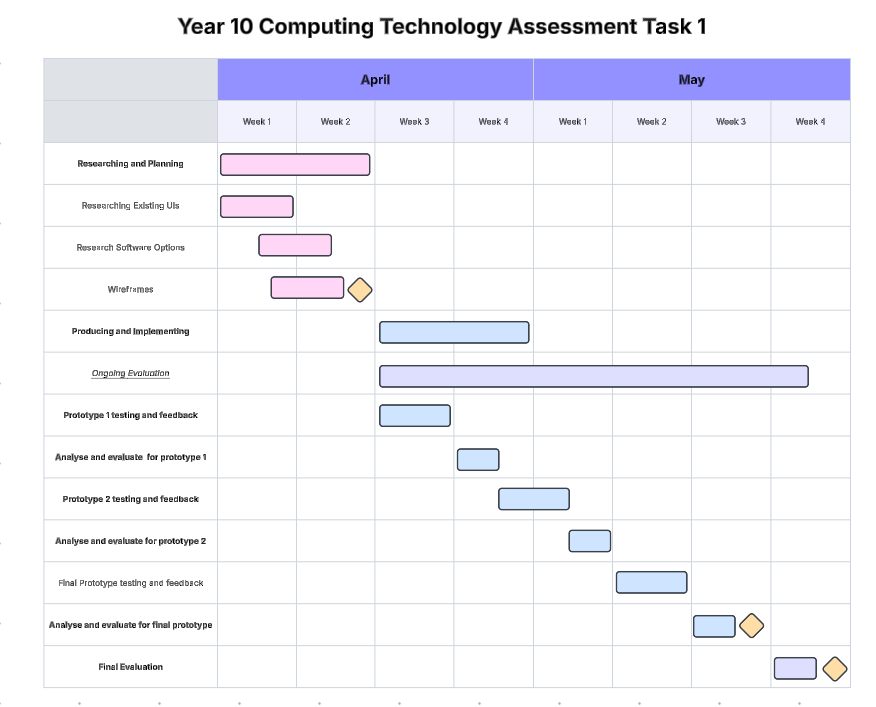
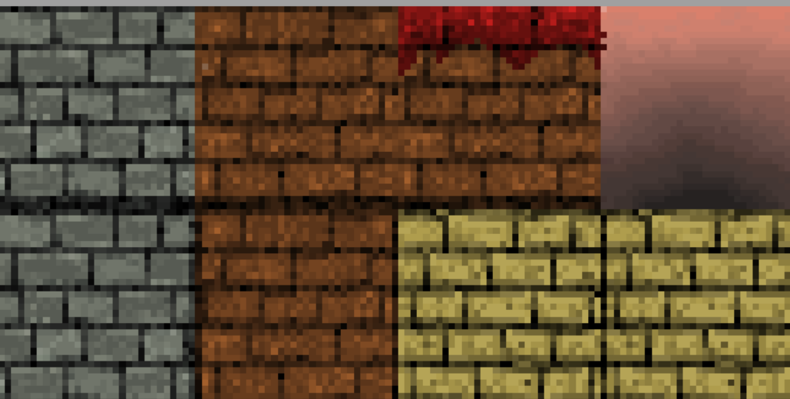
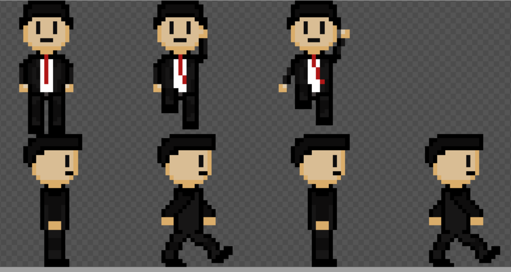
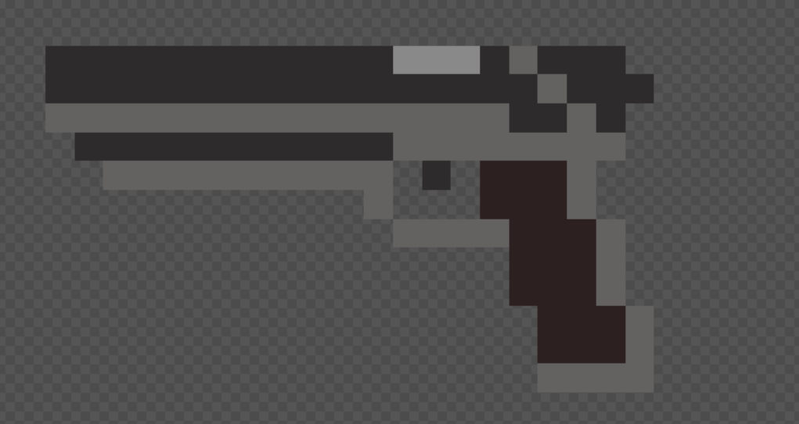
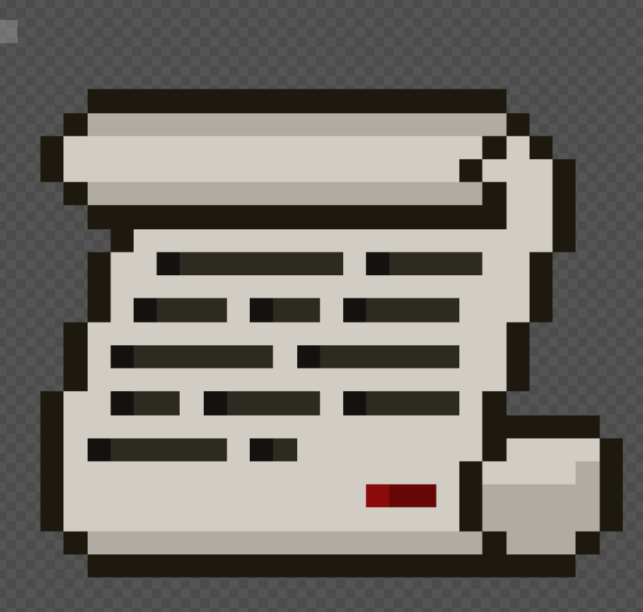
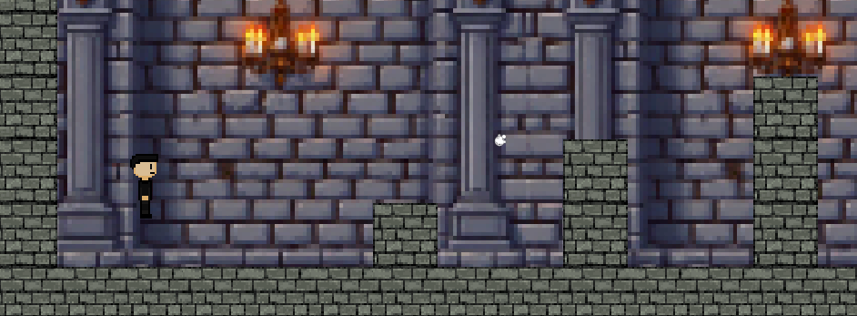
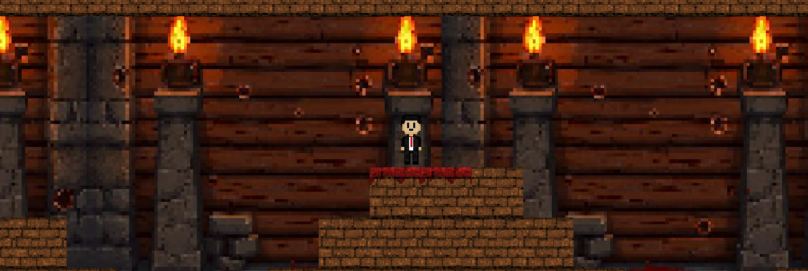

# **Assessment Task 1 - UX Design**
**By: Max Perez**

# Project Proposal

## Design Brief

The objective of my project is to encapsulate the experience of characters in the book “The Tristan Betrayal”. The type of user experience this will be done through a video game. This game will be a choose your own adventure type, starting off with choosing a character to be in the book, and making several choices in the game in order to depict the character experiences. My target audience is teenagers and young adults, around 15-25 years old, as this game will require some level of maturity.

## Book Choice and Justification
The name of the book I have chosen is ‘The Tristan Betrayal”, written by Robert Ludlum. The book contains themes of romanticism, thriller, espionage and war. During world war 2, the Nazis are at the height of their power, France occupied, Britain is enduring the blitz and is under constant threat of invasion, America is neutral and Russia is in an uneasy alliance with germany. The main character, Stephen Metcalfe is part of a prominent family, and has romantic relationships with many desirable women. He is also a minor asset in the US secret intelligence forces in europe. However, the spy network that he is part of is getting dismantled, in the midst of war-torn Europe and he is left without any contact, actual orders, or a contingency plan. I chose this book because it appeals to my interests of World War 2, particularly on the events that happened behind the frontlines, and I feel like this book explores that concept very well. 

## User Experience Type
My project will take the form of a platform game. By choosing this, it allows users to experience how the events took place within the book such as the challenges they faced, both physically and in the choices they make. This will be done through an interactive platform game with different cutscenes in between levels to help further the understanding of the context and events that happen within the book.

## Target Market
My intended audience would be individuals between the ages of 15-25  years old. They would have to require some level of maturity, because the themes that this book covers are quite graphic, even though the game will not actually be as violent to that extent. However, anyone who has an interest in World War 2, or espionage or even a bit of romance can enjoy the game. This project will appeal to them because it represents the difficulties, challenges and special moments that characters would face. It would also depict the significant events that happened in World War 2 in a fun, informative way. These design choices will cater to the audience because everything that happens in the book will be represented in a fun interactive game that conveys all of the events in the book in a way that both challenges and appeals to the person's interests and values. 

##  Software and Tools 
The software I plan to use: Unity, Excalidraw and Piskel. I would use Unity to make the game itself, editing the files and code from a previous game to make my game. Piskel will be used to create the sprites and characters in the game. Excalidraw will be used to plan the game with a mind map. All of these things will be suitable for my project because for me, it would be the easiest way to make my game. 

## Three-Tiered Mind Map

## Evaluation:

**Design Elements** - the design elements includes levels and characters inspiration and a colour palette, which represents what I plan the game will look like, regarding the aesthetics. The aesthetics for the game will probably be feasible as I can get a variety of colours from piskel, and I can design characters and backgrounds however I want. The impact of the design elements would have a heavy impact on the game itself because it will depict the feelings that the players would feel when playing the game itself, impacting the level of engagement of the players and would also represent the settings and different locations in the book. The very contrasting colours and design elements would be very effective in making the players more engaged to the game, and help them to be constantly invested in order to finish the game. 

**User Interaction** - the user interaction includes levels and information in levels, which shows the structure of what the game and how players would go through the levels and get information about the book. Making the levels themselves and the information before, in, and after levels would prove to be the hardest part for me, as I would have to learn how to do this the most efficient way possible, as for me this area of the project I have the least amount of knowledge in. However, it is still feasible. The user interaction would have a very significant impact on the whole game as it is basically how the players actually play the game. If the players cannot play the game, then the entire game would not work. I feel having many different levels, with different themes, different objectives and different types of levels would really engage with the audience and make it very effective with the interaction of users. 

**Key Themes** - the key themes includes themes of book from inspiration and in game, which basically shows what type of games I am taking inspiration from, to show what the game will turn out to look like in terms of type of game, and the themes of the book are listed to show what sort of themes the game will try to depict throughout it's levels. Depicting these themes throughout the game would be very feasible, as most of the key themes would be represented through the design elements, the type of games that the levels would be, and the type of information that would be communicated to the players. Portraying these themes in the game would be very effective in expressing the themes of the book itself.  

## Functional Requirements

- **Purpose of the Application**
    - The game will allow users and players to explore the different events that happen in the book, through the point of view of a few different characters. This game is design to engage fans with the book, as its not really a promotion of the book itself, more as something fans can play because they already enjoy the book. 
- **Use Cases**
     - *Choice of Character*: before playing the game, the player will have to choose what character they will play. For example, they could play Stephen Metcalfe, the main character, or Svetlana Baranova, the main characters former lover, who also plays a crucial part in the book. The choice of character will determine which side you play for, the type of actions that you'll have to make, and also the different things that will happen to you. 
     - *Character Backstory*: the player can choose to view the characters back story, which can provide some crucial context and potentially clues on how to solve the level, as well as the general information within the book. For example, the player can view the backstory of Stephen Metcalfe, learning that he can use the most obscure of items as a deadly weapon, which can help the player within levels.
    - *Clues*: if the player is having some trouble with the level, and they need some help, by clicking on the clue button, they will be provided with some extra assistance. For example, if the player cannot solve a puzzle in the level, they can click on the clue button which can tell them the answer of one of the puzzles, or might simply tell them to look closer at the title of the level.
    - *Menu Button*: if the player wishes to pause the game, quit, or change the level they are on they can click the menu button to choose a button to do the respective action.
- **Text Cases (Planned)**
    - *Choice of Character*: When the player first starts the game, they will have to read through the background information, providing information about the characters that they will have to choose from. But after that, an option will click up on which character they want to play. I will test these features by manually clicking on each button for each character, and will determine whether it works. 
    - *Character Backstory*: The player will recieve the character backstory when they first check on the character, but if they wish to see the backstory in the level, then they will have to go to the menu, and choose the button that says "Character Backstory". I will test this by choosing the character first, then clicking on the menu during a level and clicking the "Character Backstory" button. I will do this for each of the characters.
    - *Clues*: By clicking on the clue button, also located in the menu dropdown, it will take you to a screen which tells you the clue for that respective level. I will test this by choosing a character, going through all the levels and checking the clues for each level. I will repeat this with each character.
    
## Non-Functional Requirements

- **Performance**
    - The game will deliver smooth, seamless transitions between different game screens and scenes, with minimal delay. Character movement and actions will also be smooth with almost no delay and the different buttons that will be clicked will provide good transitions between different scenes. 
- **Usability**
    - Some design features that I will include to ensure maximum usability are:
    - *Consistent Layout*: Having a consistent layout will make sure that it will be easier for new players to learn how to play the game, as well as helping them get familiar with the game quicker. 
    - *Evident Buttons*: By making the buttons very easy to see and differ from the background, the player will be able to easily determine which button to click, and to know which button will do what action, hence less confusion when playing the game. 
    - *Easy Controls*: Having easy controls for the game will make it so much easier to play the game itself, maximising the satisfaction the players will feel when playing the game.
- **Reliability**
    - In order to ensure reliability, I will make sure to run consistent tests for each action of each character and button, making sure that whatever happens will move smoothly. Since this is mainly designed as a laptop/PC game, I will not have to test across different devices, and will just have to test between different screen sizes, which shouldn't be too much of a problem. 
- **Security**
    - The app will not be collecting any user data besides the gameplay of the player. The data will be stored locally on their device. 

## Social, Ethical and Legal Issues 
- **Social Impact**
    - *Target Audience Considerations*: The targetted audience for this game will be teenagers and young adults, around 15-25 years old. There wont be many  accessibility considerations, as the controls for the game is designed to be very easy to learn and use, however the game might have difficult levels that will not account for the specific accessibility needs of other people. 
    - *Potential Benefits*: My game will positively impact the community of the book, as the game is designed to hook players that are already interested in the book, and help them to enjoy the book even more through playing the game. After the players complete the game, there will be a message to share the book with their friends and to show them the game too, encouraging people to read the book and play the game.  
    - *Potential Risks*: There are a few minor risks that are in the game. Some certain groups of people might be misrepresented, such as the KGB (Russians) and Germany, which are portrayed to be the villans in the book, but if you play as Svet Lana, the French and America will be portrayed as the villans. Furthermore, the game will be an oversimplifcation of the events in the book, and may include missleading information about the events of World War 2. 
- **Ethical Responsibilities**
    - *User Data & Privacy*: The prototype will only collect the data of the gameplay of each character, which will be stored locally on the file on the laptop/PC. No one else will have access to the file on their computer, only them. 
    - *Represenetation & Inclusion*: The project will aim to equally represent all characters, themes and ideas from the book. This will be done through the fair representation of all features in the game. Before the levels start, the player will have a choice to choose between characters, providing a backstory for each one. The themes of the book, which are mainly about World War 2, will also be equally depicted, making sure to include both sides in the book. The ideas of betrayal and espionage in the books will also be portrayed fairly, through the different levels that all characters will have to face. 
    - *Content Sensitivity*: Some topics in the book can be interpreted as controversial or sensitive, but that is also why some level of maturity is required to play, and read the book. The game will not exclude certain sensitive topics like Nazi Germany and Hitler as they are what the book is about, but will filter out any profanity and sexual references, ensuring that the game will only require the most necessary of controversial themes. 
- **Legal Consideration**
    - *Copyright & Intellectual Property*: I won't be using any images or fan content for my game, however, there will be some quotes that I will use from the book. However, I will make sure to reference them to the book. All my assests will be of my own creation, however inspired by the description in the book. 
    - *Terms of Use*: If i were to launch this game, it wouldn't be too necessary to add restricitons, but if I were to launch it, I would make sure to add some age restrictions. As stated before, this game will require some level of maturity, as the game will include some graphic and sensitive topics such as violence, death, and themes relating to World War 2. I also don't think there would be any legal regulations that would need to be applied. 

    ## Researching and Planning
 - **Gantt Chart**
    
 - **Research Existing UI's, PMI Chart**

| UI Name | Plus | Minus | Implication | 
| ----------- | ----------- | ---- | ---- |
| Super Mario Bros | This game contains features that make it a good UI. More specifically, features like the movement of the character and straightforward objective of the game creates a simple way to tell the story and makes it really easy to understand the motives behind the character.  | However, although the sleek design of the game is good to some extent, I believe that there isn't enough variations in colors and textures within each level, and some of the features in the game like the obstacles are kind of repetitive, which inhibits the story telling of the game.  | In my game, I will be sure to include the simple, straightforward goals of each level, to make sure it can tell which chapter of the story that the character is in, but I will also make sure that there is more variations in colors, textures, and even gameplay to make it feel more exciting as there are multiple setting changes within the book.|
| Tower of Destiny | In this game, the fast, minimalistic switch between scenes like in between levels and deaths make the game much more appealing as it feels much more fast paced and dramatic, whereas if the transitions were slower it would be much less exciting.  | Similar to super mario, the game is too repetivie. Although there is a variety of different obstacles, the objective stays the same and the stakes don't feel any higher, even if the obstacles and challenges do get higher. There is no sense of change in settings.  | In my game, I will include the fast transitions in between scenes like between different levels, and I will make sure that the scene and challenges get harder or more advanced as the game progresses. |
| Prodigy | I particularly enjoy the UI of prodigy. This game consists of many different features that make the game very interesting and advanced, however, if the UI wasn't well designed, the game would be a pain to navigate. More specifically, the player inventory is sorted in a very organized manner which makes the whole game experience more enjoyable. | Unlike the Tower of Destiny, the transitions between different scenes, levels and even settings pages are very slow, with a lot of unnecessary animations which make the game very slow paced, which is very annoying.  | In my game, I will include very organized, well thought out settings, which will make the game very easy to navigate, and I will keep animations and transitions to a bare minimum as having unnecessary features will hinder the story telling of the game.  |

 - **Research Software Options**

 | Software Option | Plus | Minus | Implication |
 | -- | -- | -- | -- |
 | Figma | -- | -- | -- |
 | Adobe XD | -- | -- | -- |
 | Unity Game Design | -- | -- | -- |

 - **Wireframes**
 - **Feedback**
    - *Usability*
    - *Aesthetics*
    - *Functionality*
 - **Feedback Evaluation**

 ## Producing and Implementing and Testing and Evaluating

 - **Ongoing Evaluation**

    - April:
    
    
    During the month of April, most of my work consisted of the design of tilesheets and sprites. This took a very long time, especially during the holidays, because I wanted to make sure the game was as aesthetically pleasing and enjoyable as possible. I also wanted to make sure that the tilesheets were able to accurately represent and encapsualte the different settings that the character was present in the book, which considering the final product, was done very well. 

    - May:
    
    
    During the month of May, I was able to get the majority of my theory done. This is because my all my prototypes were created during this month. I also had to create some other sprites including the gun and the paper sprites. 

 - **Prototype 1**
    - *Prototype:*
    
    My first prototype of the game is the character movement. The progress of the movement was annoying and I did encounter problems with the animation. To solve this, I spent 45 minutes debugging, trying to figure out what went wrong, but I couldn't so I ended up just restarting, and I was able to do everything properly again, however I did not find out what went wrong the first time. 
    - *Test:*
    Testing the movement was simple, just moving the character around. Some feedback that I recieved included how poor the movement was. More speicifcally, how the character was too fast and felt as though there was no mass and gravity. At first, I had already changed some of the movememnt from the default settings, and I thought it was just fine, however after it was pointed out, it would make the gameplay much harder as it was quite hard to control the character. 
    - *Evaluate:*
    The evaluating process included changing each of the characters settings, kind of just playing around until I found something that felt right. In the end I adjusted it in such a way that made the character much slower, but with a much more realistic movement.  
 - **Prototype 2**
    - *Prototype:*
    
    My second prototype is the Splash Screen. This process was relatively straightforward, however I did encounter one problem, which was the creation of the background of the splashscreen. I did not take into consideration the fact that the tilesheets I had for the levels wouldn't match the splashscreen, so I had to frantically make a new tilesheet, which is also slightly pixelated which is annoying. Similarly, the title is also very pixelated and I don't know how to fix it. Regarding the functionality of the buttons, it works perfectly. 
    - *Test:* There was only one test regarding the splashscreen because it worked first try. However, I did recieve some feedback concerning the colour of the buttons and the title. Originally I made it blue but my friend pointed out how it blended in with the background a bit so I change it to red to help it pop out a bit more. 
    - *Evaluate:*
    The final form of this prototype consisted of a very simple splash screen with a title and two very simple buttons, which all work perfectly. 
 - **Prototype 3**
    - *Prototype:*
    
    My final prototype was the entire game. During the creation of the game I experienced many problems. One of these problems included the inconsitency of the sprites movement during testing and builidng and running it. For some reason, which I don't know why, when testing the game and playing it, the movement is much faster than when I build it and run it, which was very irritating because there are two different versions of the characters movement, which made it very hard to keep tabs on which levels or obstacles worked and which ones didn't. However, I worked my way around this by simply just speeding up the speed, which made the testing of the character much faster, but after building and running it, the game worked just fine. Regarding the aesthetics, I feel as though I did a good job at making it look good as it depicts the settings in the book quite well, and does a good job in the story telling of the book. 
    - *Test:*
    In order to test my game, I sent over my game, and they played it giving some feedback. This included how good the background was and how aesthetically pleasing it was. Moreover, they also liked the splashscreen design too. However, they thought there could've been 
    - *Evaluate:*
    My finished game consisted of 2 levels and a splashscreen, with functionaly mechanics like walking and jumping. The game was successfully demonstrates the narrative of my book, through devices such as the different levels describing the settings of the different chapters in the book, the objective to find the file, and to get over obstacles and avoid being gunned to death. 

## Final Evaluation 

Ultimately, my game does meet certain aspects of the functional and non functional requirements and does somewhat meets the intentions outlined in my design breif. 

My game, regarding the functional and non functional requirements, fullfils most of the requirements. More specifically, the game does meet its purpose of providing a new way of enjoying the book through a different perspective, and does include some clues within the game that depicts how different problems were solved in the book. However, certain features like choosing which character to play or more development on the clues were not include in the game, which could hinder the story telling. Moreover, concerning performance, usablity, reliablity and security all meets the desired standard, more particularly, the transitions between levels were smooth and seamless. 

The final product is also suitable for the desired audience, and also fullfills its purpose of depicting the events in The Tristan Betrayal, however, if certain features were added, like the clues feature as described in functional requirements, and the option to choose another character, it would make this experience much more enjoyable. 

The game does not include anything that directly addresses relevant social, ethical and legal themes. Although the book is heavily associated with with World War 2, the game does not include any themes of such. The closet thing of that would be a gun, but the gun does not include anything that points out a paticular group. 

I feel as though I have not managed my time very well. At the beginning of the task, I spent a lot of my time designing the sprite, and more time designing the tile sheet, which was obviously not very smart because most of my work during the holidays consisted of that. However, I feel as though my work during class was quite productive, as it did help set good milestones in my theory and I could recieve help from people and the teacher in class. Furthermore, I feel as though the trip to Tasmania did somewhat hinder my ability to manage my time well, because I did lose a week. However, that is not much of an excuse because the week I came back I completed much of the remaining work, which was more than half that was already done. 

Gathering and recieving feedback was straightforward and easy, as most of the feedback I asked personally and I also requested them to be straightforward and harsh if neccessary. Most of the feedback I was able to implement into my final product, however some features like more levels or different game mechanics were unable to be put into the game. 

